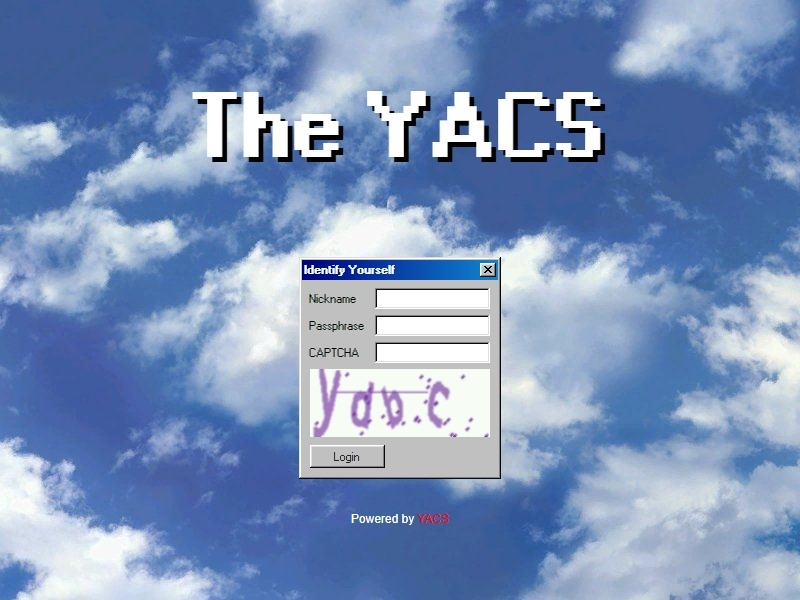

# YACS
Yet Another Chatroom Script

Inspired by [LE-CHAT-PHP](https://github.com/DanWin/le-chat-php)



## Featuring

- Multiple channels.
- Admins.
- Files and embedded images/videos.
- BBCode.
- CAPTCHA.
- Vanilla HTML & CSS & JS.
- No Cookies, it's bad for your teeth.

## Try It Out Right Now!

Join [The YACS Demo Server](https://chat.valine0x.icu) right now with passphrase **`the-yacs`** to see YACS in action!

## Deployment

### 1. Deploy with venv (Recommended)

Create a venv with python version 3.13 or greater.

```bash
$ python -m venv .venv
```

```bash
# Activate venv in *nix shell (e.g. bash, zsh)
$ source .venv/bin/activate
```

```pwsh
# Activate venv in pwsh
> . .venv\Scripts\Activate.ps1"
```


Then, install the package inside venv.

```bash
(.venv) pip install yacscript
```

Create a configuration file and edit it to your liking.

For reference, see the <a href="#configuration">configuration section</a>.

```bash
(.venv) vi ./config.toml
```

Finally, you run the server within the venv

In addition to that, you might want to deploy the program as a daemon. Here's an example of a possible simple unit file for systemd.

Assuming you have installed the venv as `/path/to/.venv`, for example `/opt/yacs/.venv`, making `/path/to/` means `/opt/yacs/` for the setup.

```ini
[Unit]
Description=YACS Service
After=network.target

[Service]
Type=simple
WorkingDirectory=/path/to
Environment="PATH=/path/to/.venv/bin"
ExecStart=/path/to/.venv/bin/yacs-run --config /path/to/config.toml

[Install]
WantedBy=multi-user.target
```

### 2. Deploy from source (with uv)

Deploying from source gives you access to the latest features but may be unstable

To deploy from source, first you need to install uv.

```bash
# Install with pip.
$ pip install uv

# Install on macOS and Linux.
$ curl -LsSf https://astral.sh/uv/install.sh | sh

# Install on Windows.
$ powershell -ExecutionPolicy ByPass -c "irm https://astral.sh/uv/install.ps1 | iex"
```

Then, clone the repo.

```bash
$ git clone https://github.com/valine-dev/yacs.git
$ cd yacs
```

Create a config file, and edit it to your liking.

For reference, see the <a href="#configuration">configuration section</a>.

```bash
$ vi ./config.toml
```

Finally, run the server, dependencies and venv will be installed along the way.

```bash
$ uv run yacs-run --config config.toml
```

Additionally, it's also possible to make a daemon service out of deployment from source.

An example unit file is shown as below.

```ini
[Unit]
Description=YACS Service
After=network.target

[Service]
Type=simple
WorkingDirectory=/path/to/yacs
Environment="PATH=/path/to/yacs/.venv/bin"
# Notice the difference to deploying from package!
ExecStart=/path/to/uv run yacs-run --config /path/to/config.toml

[Install]
WantedBy=multi-user.target
```

## User Manual

Consult <a href="docs/manual.md">User Manual</a> for guidance.

## Configuration

The program comes with a built in config, so you might want to only write fields that you need to deviates from default. 

All possible fields are shown below.

```toml
[flask]
# here you can configure built-in config values defined by flask
DEBUG = false # DO NOT SET TO `true` WHEN EXPOSING TO PUBLIC!

[app]
# The app itself will only exposed through plain HTTP and it's strongly discorage to do so directly to public web. Use a reverse proxy with TLS in front of the app.
ip = "0.0.0.0"
port = 8080

admin_phrase = "CHANGE_ME_ADMIN"
# set user_phrase to empty will expose chatroom to the public
user_phrase = "CHANGE_ME"

log_level = "INFO"
timeout = 5000 # in milisecond, use for heartbeat

# Set to true only when the app is behind a reverse proxy!
# Make sure X-Forwarded-For and X-Forwarded-Host are properly set!
proxy_fix = false

# For socketio connections
# Do set a propper value in production enviroment
cors_allowed_origins = "https://me.example"


[custom]
title = "The YACS"
motd = "Hello!\nRule No.1"

# These are the emotes that will rendered to the webpage 
emoticons = [
    "( ﾟ∀。)",
    "Insert Anything",
    "⭐"
]


[res]
path = "./resource" # Relative to project's root
size_max = 1024 # In Megabytes


[captcha]
length = 4
max_cache = 60
expire = 120 # Expire time in seconds

[captcha.options]
# you don't want to have all of them turn on, it'll be confusing
numbers = false
lowercase = true
uppercase = false

[db]
path = "./yacs.db"
```

And, an example config could look like this.

```toml
[flask]
DEBUG = false

[app]
admin_phrase = "this-is-admin"
user_phrase = "hello"

[custom]
title = "My YACS Server"
motd = "Hello!\nRule No.1!"
```

## Acknowledgement
YACS will not be possible without following existing projects.

- [98.css](https://github.com/jdan/98.css)
- [flask](https://github.com/pallets/flask/)
- [bbcode](https://github.com/dcwatson/bbcode)
- [webargs](https://github.com/marshmallow-code/webargs)
- [captcha](https://github.com/lepture/captcha)
- [flask-socketio](https://github.com/miguelgrinberg/flask-socketio)


## Loicense
Oi mate! Got a loicense for that project Govna? Yes, and it is the best one!

YACS is licensed under WTFPL with NO WARRANTY.

<a href="http://www.wtfpl.net/"></a>
