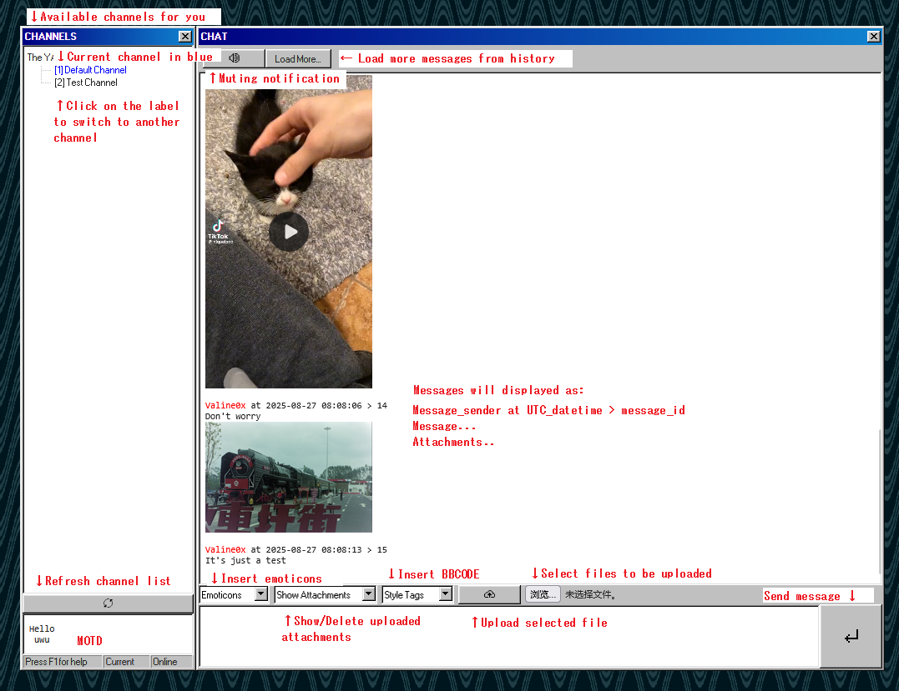
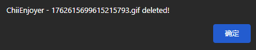

# User Manual

## Guest

### Login

Upon accessing `http://your.site/`, you'll be greeted by the following interface.

> Note: The interface may appear differently in Chromium-based or WebKit-based browsers such as Google Chrome and Safari. These visual inconsistencies do not affect functionality and will be addressed in future updates.

Nicknames should **only** contain uppercase and lowercase ASCII letters, numbers, and underscores. and should be between 3 and 16 characters.

Passphrase is defined in `config.toml` as `app.user_phrase`. Anyone using `user_phrase` to log in will count as a guest.

Share passphrase **only to ones you trust**!

CAPTCHA will expire in a certain amount of time upon request, as defined in `captcha.expire`. Refresh the page to request a new CAPTCHA.

Once all fields are filled, press `Enter` or click `Login`.

### Room

After multiple redirections, you'll end up in the room page, where messages are read and sent.

#### General look

#### Style Tag

Assume that you had your messages.

By adding a style tag, you can style your message.

First, you select the sections you want to style.

Then, from `Style Tags`, select the style tag you need.

Selected texts will be surrounded by style tags.

Press `Ctrl+Enter` or click the send message button to submit your styled message.

And it's a success.

YACS supports BBCODE for styling with tags you can find in [`tags.txt`](../tags.txt), HTML tags will be escaped.

#### Uploading Attachments

In general, you'll need three steps to upload your attachments.

First, you select a file with "Select file" with a file selection prompt open. File size should be less than `res.size_max` in `config.toml`.

Then you hit the upload button  to upload file to the server. The upload finishes when a pop-up window notifies you.

At this stage, the file is not yet a permanent resource; it is temporarily cached in the server's memory, that’s why you can easily delete them before the message being sent.

By clicking `Show Attachments`, you'll see the file you have uploaded.

Click on one of the items, and you'll be prompted with whether you want to delete the upload.

By confirming, you'll soon be alerted by the pop-up saying it has been deleted.

Send your message with attachments. Attachments that are identified as images and videos will be able to embed in your message. Otherwise, a download link will be provided.

> ATTENTION!
> 
> Download link/source of images and videos are **avaliable to public without authentication**. It's designed to be so since the application works without holding a session with cookies. Yet it's still relatively safe because resources are accessed only by their UUIDs, and there’s no way you can access the file list without authentication. Still, it’s highly discouraged to risk your privacy.